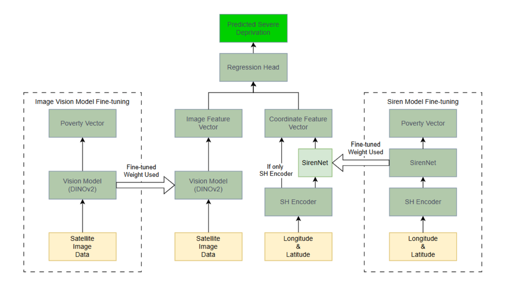

# Extension works on KidSat: Enhancing Satellite-Based Poverty Estimation through Spatial Encoding and Regression Head

This repository contains extension work on the [KidSat: satellite imagery to map childhood poverty](https://github.com/MLGlobalHealth/KidSat) dataset and benchmark project. Our extensions enhance the original computer vision pipeline by integrating **multi-modal learning**, which combines satellite imagery with **geographic coordinate encodings** (e.g., Spherical Harmonics and SIREN-based representations). The system aims to improve prediction of the percentage of children experiencing severe deprivation in each region through **spatially-aware regression architectures** that incorporate both visual and location-based information and refined training pipeline.

## Key Improvements
Based on our proposed framework, we explored several methods to improve fine-tuning and reduce prediction error (MAE) through spatial analysis:

1. **Enhanced Data Processing Pipeline:** Improved data cleaning and feature selection  
2. **Spherical Harmonics Spatial Encoders:** Added geographic information encoding  
3. **SIREN Network Integration:** Optional learnable spatial feature representation  
4. **Advanced Regression Heads:** Non-linear models for final prediction

**Main Result:** Our best configuration (improved data processing + Spherical Harmonics encoding + LightGBM regression head) achieved a **15.8% reduction in MAE** compared to the original pipeline.

## Architecture Overview

*Figure 1: Enhanced pipeline architecture. Left: Standard DINOv2 fine-tuning on satellite imagery. Center: Feature extraction combining visual embeddings with spatial encodings. Right: Optional SIREN pre-training for learnable geographic representations. The system supports both basic Spherical Harmonics encoding and advanced SH+SIREN approaches.*

## Prerequisites
### Data Setup
For DHS data access and satellite imagery collection, please follow the instructions in the [original KidSat repo](https://github.com/MLGlobalHealth/KidSat). You'll need:
- DHS survey data for 16 countries in Eastern and Southern Africa  
- Google Earth Engine access for satellite imagery  
- Landsat 7/8 satellite images ($336\times 336$ pixels for our experiments)  
### Environment Setup
```bash
pip install -r requirements.txt
```

## Extension Components
### 1. Enhanced Data Processing
Our improved data processing pipeline includes:
- Dimensionality reduction from 99 to 74 features by combining rarely used indicators  
- Removal of country-specific columns that introduced noise  
- Inclusion of previously excluded data points within acceptable thresholds  
- ~10% increase in usable training data  

### 2. Spatial Encoding with Spherical Harmonics
We implement Spherical Harmonics (SH) encoding to embed geographic information directly into the model pipeline:  
```python
# Coordinate transformation
colatitude = π/2 - lat * π/180
azimuth = lon * π/180

# SH basis functions up to degree L=15 (default)
# Yields 512-dimensional real-valued feature vector
```

**Optional SIREN Network Finetuning**: By default, a 4-layer network (256 neurons each) with sinusoidal activations can learn complex location-specific relationships, mapping SH vectors to 128-dimentional learned geographic embeddings.

### 3. Enhanced Regression Heads
Instead of simple Ridge regression, we evaluate several non-linear regression methods:  
- **LightGBM** (best performance)  
- XGBoost  
- Random Forest  
- Deep Neural Networks  

## Results Visualization
Our enhanced pipeline shows significant improvements in spatial prediction accuracy:


*Figure 2: Administrative Level 2 mean absolute error visualization. Left: Baseline model performance. Right: Enhanced model with SH encoding and LightGBM. The improved model shows notably reduced error rates across Eastern and Southern Africa, with particular improvements in Mozambique, Angola, and Madagascar.*

## Usage
### Step 1: Enhanced Data Processing
Process DHS survey data with improved cleaning pipeline:
```bash
cd survey_processing
python main.py dhs_data --cleaned
```
The `--cleaned` flag applies the enhanced data processing that reduces dimensionality from 99 to ~74 features and includes ~10% more training data.

### Step 2: Fine-tuning Options
#### Option A: Standard DINOv2 Fine-tuning (Baseline)
```bash
python finetune_spatial.py \
    --fold 1 \
    --model_name dinov2_vitb14 \
    --imagery_path {path_to_imagery_folder} \
    --batch_size 8 \
    --imagery_source L \
    --num_epochs 20 \
    --cleaned
```

#### Option B: SH only (Best Performance - Recommended)
Standard DINOv2 fine-tuning with Spherical Harmonics encoding applied during evaluation:
```bash
python finetune_spatial.py \
    --fold 1 \
    --model_name dinov2_vitb14 \
    --imagery_path {path_to_imagery_folder} \
    --batch_size 8 \
    --imagery_source L \
    --num_epochs 20 \
    --cleaned
```
*Note: The SH encoding is added during evaluation phase, providing the best performance with no additional training complexity*

#### Option C: SH + SIREN (Two-stage training)
**Stage 1:** Pre-train SIREN network on geographic coordinates:
```bash
python finetune_siren.py \
    --fold 1 \
    --imagery_path {path_to_imagery_folder} \
    --imagery_source L \
    --representation_dim 128 \
    --hidden_dim 256 \
    --num_layers 4 \
    --batch_size 32 \
    --num_epochs 200 \
    --sh_L 15 \
    --cleaned
```
**Stage 2:** Standard DINOv2 fine-tuning (same as Option A):
```bash
python finetune_spatial.py \
    --fold 1 \
    --model_name dinov2_vitb14 \
    --imagery_path {path_to_parent_imagery_folder} \
    --batch_size 8 \
    --imagery_source L \
    --num_epochs 20 \
    --cleaned
```
### Step 3: Evaluation
#### Standard (visual-only)
```bash
python evaluate.py \
    --fold 1 \
    --model_name dinov2_vitb14 \
    --imagery_path {path_to_parent_imagery_folder} \
    --imagery_source L \
    --mode spatial \
    --use_checkpoint \
    --cleaned
```

#### Visual + (SH + SIREN)
```bash
python evaluate.py \
    --fold 1 \
    --model_name dinov2_vitb14 \
    --imagery_path {path_to_parent_imagery_folder} \
    --imagery_source L \
    --mode spatial \
    --use_checkpoint \
    --use_location_features \
    --coord_encoding_method sh_siren \
    --cleaned
```

#### Visual + Spherical Harmonics
```bash
python evaluate.py \
    --fold 1 \
    --model_name dinov2_vitb14 \
    --imagery_path {path_to_parent_imagery_folder} \
    --imagery_source L \
    --mode spatial \
    --use_checkpoint \
    --use_location_features \
    --coord_encoding_method spherical_harmonics \
    --cleaned
```

### Configuration Options
#### Core Arguments (finetune_spatial.py):
- `--fold {1,2,3,4,5}`: Cross-validation fold number  
- `--model_name`: DINOv2 model (`dinov2_vitb14`, `dinov2_vitl14`)  
- `--imagery_path`: Path to parent imagery folder  
- `--imagery_source {L,S}`: L=Landsat, S=Sentinel  
- `--emb_size`: Learned model output embedding size (default: 768)  
- `--batch_size`: Batch size
- `--num_epochs`: Training epochs
- `--grouped_bands`: RGB band selection (e.g., `4 3 2` for Landsat 8, set to `None` for automatic choice)  
- `--cleaned`: Use enhanced data processing pipeline  
- `--country`: Two-letter country code for single country training

#### SIREN Training Arguments (finetune_siren.py):
- `--fold {1,2,3,4,5}`: Cross-validation fold number  
- `--imagery_path`: Path to parent imagery folder  
- `--imagery_source {L,S}`: L=Landsat, S=Sentinel  
- `--representation_dim`: Learned representation dimenstion (default: 128)  
- `--hidden_dim`: SIREN hidden layer dimension (default: 256)  
- `--num_layers`: Number of SIREN layers (default: 4)  
- `--batch_size`: Batch size  
- `--num_epochs`: Training epochs  
- `--sh_L`: Spherical Harmonics degree (default: 15)
- `--grouped_bands`: RGB band selection (e.g., `4 3 2` for Landsat 8, set to `None` for automatic choice)  
- `--cleaned`: Use enhanced data processing pipeline  
- `--country`: Two-letter country code for single country training

#### Evaluation Arguments (evaluate.py):
- `--fold {1,2,3,4,5}`: Cross-validation fold number (for spatial mode the script runs for all 5 CV folds by default)   
- `--mode {spatial,temporal}`: Evaluation benchmark type  
- `--use_checkpoint`: Use fine-tuned models instead of raw pretrained  
- `--use_location_features`: Enable spatial encoding features  
- `--coord_encoding_method {spherical_harmonics, sh_siren}`: Spatial encoding method  
- `--use_location_encoder`: Use research-validated LocationEncoder library  
- `--imagery_path`: Path to parent imagery folder  
- `--imagery_source {L,S}`: L=Landsat, S=Sentinel  
- `--grouped_bands`: RGB band selection (e.g., `4 3 2` for Landsat 8, set to `None` for automatic choice)  
- `--cleaned`: Use enhanced data processing pipeline  
- `--country`: Two-letter country code for single country training

### Complete Workflow Example
For the best results (SH + LightGBM), run this complete workflow:  
```bash 
# 1. Process data with enhancements
python survey_processing/main.py survey_processing/dhs_data --cleaned

# 2. Fine-tune DINOv2 for all 5 folds  
for fold in {1..5}; do
    python modelling/dino/finetune_spatial.py \
        --fold $fold \
        --model_name dinov2_vitb14 \
        --imagery_path {your_imagery_path} \
        --imagery_source L \
        --batch_size 8 \
        --cleaned
done

# 3. Evaluate with SH (this uses Ridge regression, also saves the used features that can be used to get lgb result)
python modelling/dino/evaluate.py \
    --model_name dinov2_vitb14 \
    --imagery_path {your_imagery_path} \
    --imagery_source L \
    --mode spatial \
    --use_checkpoint \
    --use_location_features \
    --coord_encoding_method spherical_harmonics \
    --cleaned

# 4. Apply LightGBM to saved features 
# See regression.ipynb for example implementation
# Or use saved CSV files in modelling/dino/results/
```
**Key Insight:** The evaluation script saves extracted features (visual + spatial) that can be used with any regression head. The Ridge regression provides a baseline, but applying LightGBM to these same features yields the best performance improvement.

